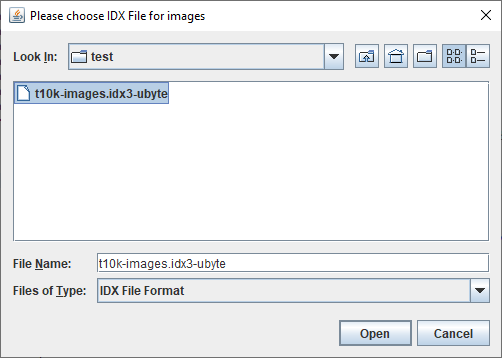
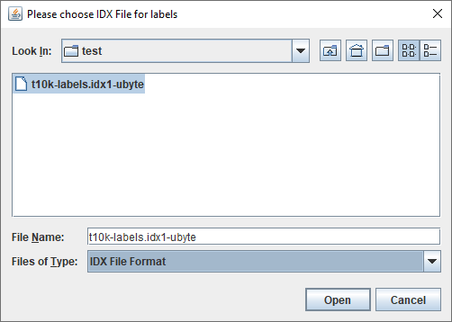
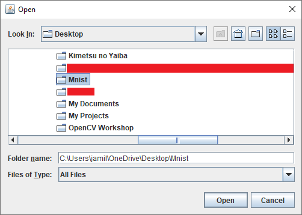
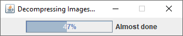
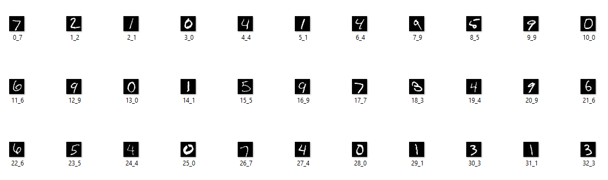

# MNIST Decompressor

Wanting to test my own implementation of a CNN from scratch, I create a decompressor for the [MNIST dataset](http://yann.lecun.com/exdb/mnist/).

---
# Format

The dataset is split to training data and test data.

Each batch comprises of two files each in IDX file format.

Quoting the website linked above:

> The IDX file format is a simple format for vectors and multidimensional matrices of various numerical types.<br/>
The basic format is<br/>
magic number<br/>
size in dimension 0<br/>
size in dimension 1<br/>
size in dimension 2<br/>
.....<br/>
size in dimension N<br/>
data<br/>
The magic number is an integer (MSB first). The first 2 bytes are always 0. <br/>
The third byte codes the type of the data: <br/>
0x08: unsigned byte <br/>
0x09: signed byte <br/>
0x0B: short (2 bytes) <br/>
0x0C: int (4 bytes) <br/>
0x0D: float (4 bytes) <br/>
0x0E: double (8 bytes) <br/>
The 4-th byte codes the number of dimensions of the vector/matrix: 1 for vectors, 2 for matrices.... <br/>
The sizes in each dimension are 4-byte integers (MSB first, high endian, like in most non-Intel processors). <br/>
The data is stored like in a C array, i.e. the index in the last dimension changes the fastest. 

So what does this mean for us?

Well first, the each pixel in each image is encoded in unsigned bytes. This is because the image is in grayscale with values 0 (black) to 255 (white). One unsigned byte covers that range exactly.

Next, for the label dataset, the data is just 1 dimensional (just labels 0-9) while the image dataset is 3 dimensional (number_images x rows x columns).

We conclude that the first 32 bits of the label file should contain 0x00000801 (the 0x08 for unsigned bytes and the 01 is for number of dimensions), while similarly the images file begins with 0x00000803.

Now for each dimension, a dimension size is provided as an unsigned integer (32 bits). This integer is formatted as MSB first and high endian. To read the integer a function is created:

    private static int readInt(int offset, byte[] bytes) {
		int result = 0;
		result |= (bytes[offset] & 0xFF) << 24;
		result |= (bytes[offset + 1] & 0xFF) << 16;
		result |= (bytes[offset + 2] & 0xFF) << 8;
		result |= (bytes[offset + 3] & 0xFF);
		return result;
	}
Here for example, to get the first dimension's size (for images data file it would be number of images), we have as value ```offset = 4 (bytes)``` since the first 4 bytes already are taken by the "magic number".

Finally, we read the number of images, number of columns, and number of rows for the training/test data file.
For optimization, we create a ``BufferedImage`` as
    
    BufferedImage image = new BufferedImage(rowSize, columnSize, BufferedImage.TYPE_BYTE_GRAY);
Create a loop that initializes an offset of 16 (4 bytes for magic number and 3 * 4bytes for the dimension sizes).

Then, fill in the image with rowSize*columnSize values in the correct order (column by column). Once the image is filled, output the image as such

    ImageIO.write(image, "jpg", new File(dir.getAbsolutePath() + "\\" +count+"_"+ (labels[count + 8]&0xFF) + ".jpg"));
    
To explain some variables up in that statement:
- ``image`` is the BufferedImage we filled up
- ``dir`` is the directory requested to output to (prompted at beginning of program)
- ``labels`` is the label file in as a byte array.
- ``count`` is the number of images output so far.
- ``labels[count+8]`` is the actual label of the image being output. We add an 8 for the offset of 4 bytes (magic number) + 4 bytes (unsigned int for number of labels).
---
# Demonstration
We first specify the images IDX file.



Then we specify the labels IDX file.



We then specify the output file.



The code decompresses the images.



And finally, *voila!*



